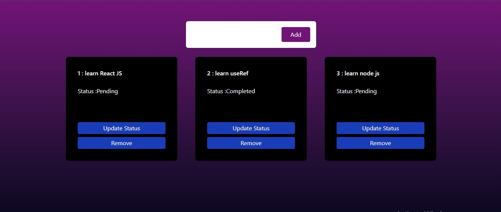
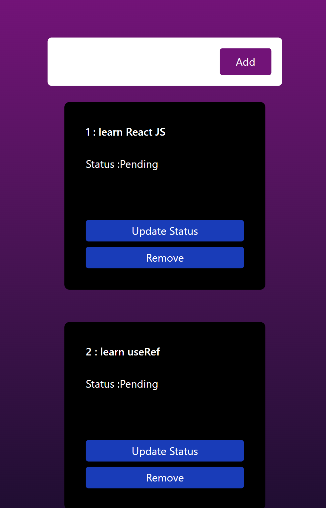

## React Assignment
# Todo List
## A simple and responsive Todo List application built with React. This app allows users to add, delete, and edit tasks. It is designed to work seamlessly across various devices, providing a smooth and intuitive experience.

## Features
### **Add Tasks**: Easily add new tasks to your to-do list.
### **Delete Tasks**: Remove completed or unwanted tasks with a single click.

### Output
*In Big Screen*

*In Small Screen*
   - 

   - [Live Demo](https://a-new-todolist.netlify.app/)